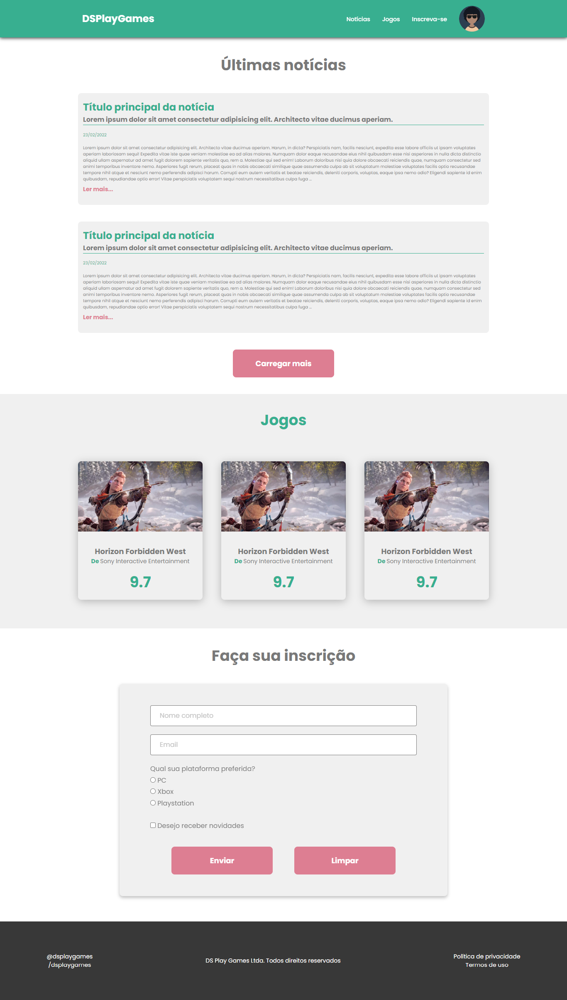

# Desafio 03 - DSPlayGames Responsivo

> Módulo 03 - HTML e CSS

Projeto referente ao Desafio 03 - Módulo 03
Curso de Formação Desenvolvedor Moderno -
DEVSuperior

Foi utilizado no projeto:

- Unidade de medida flexível;
- Variáveis;
- Media queries;

[Clique aqui para acessar] (https://gisellebm.github.io/DevSuperior-modulo3-desafio-responsividade/)

## Tecnologias

- HTML
- CSS
- Git e Github

## Contato

gisellemacedo.dev@gmail.com
